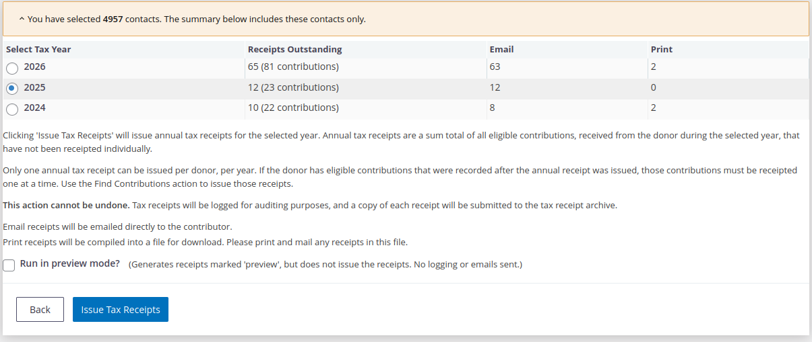
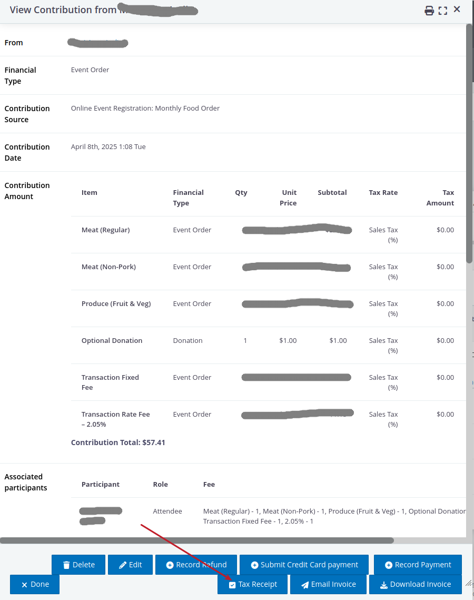
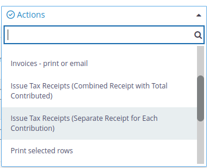
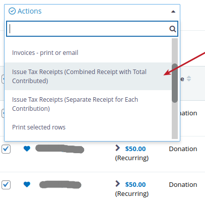
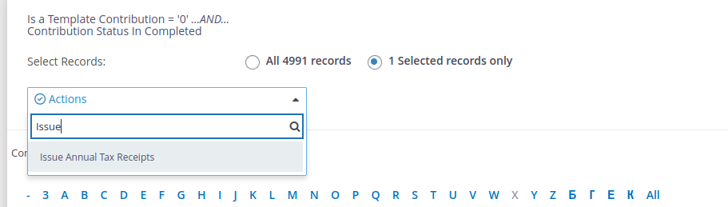
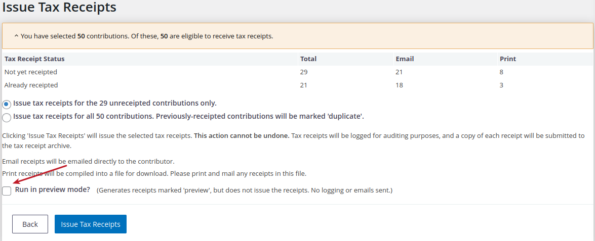

# CDNTaxReceipts

Canadian Tax Receipts extension for CiviCRM



# To set up the extension

1. Make sure your CiviCRM Extensions directory is set (Administer > System Settings > Directories).
2. Make sure your CiviCRM Extensions Resource URL is set (Administer > System Settings > Resource URLs).
3. Unpack the code
    - cd extensions directory
    - git clone https://lab.civicrm.org/extensions/cdntaxreceipts.git org.civicrm.cdntaxreceipts
4. Enable the extension at Administer > System Settings > Manage Extensions
5. Configure CDN Tax Receipts at Administer > CiviContribute > CDN Tax Receipts. (Take note of the dimensions for each of the image parameters. Correct sizing is important. You might need to try a few times to get it right.)
6. Review permissions: The extension has added a new permission called "CiviCRM CDN Tax Receipts: Issue Tax Receipts". "Edit all Contacts" is also required.

Note: if you are installing this on Drupal 8 or Drupal 9 -> remember clear the Drupal cache or you may not be able to get to the CiviCRM CDNTaxReceipts settings screen.

Now you should be able to use the module.

**Note: Compatibility issue with open_basedir**

This extension uses the TCPDF library from CiviCRM. If your server has open_basedir set initializing the library
causes a warning. To avoid this please add the following to your civicrm.settings.php anywhere after $civicrm_root
is defined:

    /**
     * Early define for tcpdf constants to avoid warnings with open_basedir.
     */
    if (!defined('K_PATH_MAIN')) {
      define('K_PATH_MAIN', $civicrm_root . '/packages/tcpdf/');
    }

    if (!defined('K_PATH_IMAGES')) {
      define('K_PATH_IMAGES', K_PATH_MAIN . 'images');
    }


# Usage

There are a few concepts at the start that are important to understand.

+ Separate Tax Receipts: This refers to sending a _separate receipts_ for **each Contribution** that was made. This task can be performed one contribution at a time, or in bulk from contribution search results.
+ Combined Tax Receipts: This refers to sending _one receipt_ **per Contact**, combining selected contributions into one total. This may be different from the contact's total annual donations depending on your search criteria and selections.
+ Annual Receipts: This refers to sending the **Total Annual** donations for a selected annual year. You _cannot_ manually select which contributions are included, only which year they should come from.

## Separate Tax Receipts One at a Time

These are receipts issued as one receipt to one contribution.

1. Go to a specific Contact Record who has made a Contribution with a Donation
2. Click on the `Contribution` tab
3. Click on `View` for a specific Contribution with the donation
4. Click the `Tax Receipt` button
5. Follow on-screen instructions on the following screen



## Separate Tax Receipts In Bulk

1. Go to `Contributions > Find Contributions`
2. Filter your search criteria by specific factors (i.e. You might want to choose a particular calendar quarter)
3. Click `Search`
4. Choose multiple `Contributions` you would like to generate a Tax Receipt for
5. From the dropdown choose `Issue Tax Receipts (Separate Receipt for Each Contribution)` (see image below)
6. Follow the instructions on the following screen



**Note:** This will send separate receipts for each Contribution made.

**FYI:** In the steps above, it is safe to choose all the Contributions that appear as this extension _will not_ generate
Tax Receipts for contributions that have no eligible line items, and will only receipt the eligible amount.

## Combined Tax Receipts per Contact

1. Go to `Contributions > Find Contributions`
2. Filter your search criteria by specific factors (i.e. You might want to choose a particular calendar quarter)
3. Click `Search`
4. Choose multiple `Contributions` you would like to generate a Tax Receipt for
5. From the dropdown choose `Issue Tax Receipts (Combined Receipt with Total Contributed)` (see image below)
6. Follow the instructions on the following screen



**Note:** Combined Receipts will add all the Contributions for each Individual's Contributions that you have selected
into one receipt, but this may not be the same as the _Total_ donations you would produce annually.

**FYI:** In the steps above, it is safe to choose all the Contributions that appear as this extension _will not_
generate Tax Receipts for contributions that have no eligible line items, and will only receipt the eligible amount.

**Important:** These are receipts that collect all outstanding contributions from the selected results into one receipt.
If some contributions have already been sent a receipt they will not be included in the total.

## Annual Receipts

1. Go to `Search > Find Contacts` (or `Search > Advanced Search`)
2. Filter as desired
3. Click `Search`
4. Select one or more contacts from the results.
5. Select `Issue Annual Tax Receipts` in the actions drop-down.
6. Follow the instructions on the following screen. You will be able to choose which year.



# Priceset with Donation fields

You do not need to do any special filtering for financial type, and doing so may miss some contributions if the contribution-level
financial type is different from the eligible line item financial type. The extension will determine if there are any eligible line
items (created by the Priceset) associated to a contribution and generate the receipts appropriately.

# Testing Tax Receipts

You can easily follow any of the instructions above for generating a `Total Receipt` or `Separate Receipt` even after you have made this extension live.

1. Follow the instructions in `Total Receipt` or `Separate Receipt`
2. Go to the `Issue Tax Receipts` screen
3. Choose `Run in preview mode`, which will simply generate a special `Preview` of the Contribution that is automatically downloaded (see image below)



# Reports

The extension also enables two CiviReport templates, found under `Reports - Contribution Reports - New Contribution Report`, which can be
used to see a list of receipts issued and receipts outstanding.

+ Tax Receipts - Receipts Issued
+ Tax Receipts - Receipts Not Issued

There is also a SearchKit-based report under Packaged Searches

+ Tax Receipts - Receipts Issued

# Tracking Emails Opened

To be able to track whether people have opened their Receipts please ensure you have included the `$openTracking` token parameter within
your message template.

**Note:** Earlier versions of this Extension required a permission -> "CiviCRM CDN Tax Receipts: Open Tracking". That's no longer required

# Hooks

## hook_cdntaxreceipts_eligible()

You may be in a situation where certain Contributions are eligible for tax receipts and others are not (e.g. donations are receiptable, but
only for individuals, and event fees are not receiptable). If this is the case, there is a PHP hook hook_cdntaxreceipts_eligible($contribution)
that can be used for complex eligibility criteria. Hook implementations should return one of TRUE or FALSE, wrapped in an array.

By default, a contribution is eligible for tax receipting if it is completed, and if its Financial Type is deductible.

```php
    // Example hook implementation:
    //  Contributions have a custom yes/no field called "receiptable". Issue tax receipt
    //  on any contribution where receiptable = Yes.
    function mymodule_cdntaxreceipts_eligible( $contribution ) {

      // load custom field
      $query = "
      SELECT receiptable_119
      FROM civicrm_value_tax_receipt_23
      WHERE entity_id = %1";

      $params = array(1 => array($contribution->id, 'Integer'));
      $field = CRM_Core_DAO::singleValueQuery($query, $params);

      if ( $field == 1 ) {
        return array(TRUE);
      }
      else {
        return array(FALSE);
      }

    }
```

## hook_cdntaxreceipts_eligibleAmount()

Use this hook, if you need to customize the amount that is tax-deductible on a receipt.

```php
    // Example hook implementation:
    //  Return a maximum tax deduction of $1000.00
    function mymodule_cdntaxreceipts_eligibleAmount( $contribution ) {
      if ($contribution->total_amount - $contribution->non_deductible_amount > 1000) {
        return array(1000.00);
      }
      else {
        return [$contribution->total_amount - $contribution->non_deductible_amount];
      }
    }
```

## hook_cdntaxreceipts_alter_receipt()

If you need to customize the variables that are passed to the receipt e.g. display name

```php
// example combining the name of a spouse in the receipt
function mymodule_cdntaxreceipts_alter_receipt(&$receipt) {
  if (!empty($_POST['is_spouse'])) {
    $relationships = civicrm_api3('Relationship', 'get', [
      'sequential' => 1,
      'contact_id_a' => $receipt['contact_id'],
      'relationship_type_id' => "Spouse of",
      'is_active' => 1,
      'options' => ['limit' => 1],
    ])['values'];

    if (empty($relationships)) {
      $relationships = civicrm_api3('Relationship', 'get', [
        'sequential' => 1,
        'contact_id_b' => $receipt['contact_id'],
        'relationship_type_id' => "Spouse of",
        'is_active' => 1,
        'options' => ['limit' => 1],
      ])['values'];
      $relContact = $relationships[0]['contact_id_a'] ?? NULL;
    }
    else {
      $relContact = $relationships[0]['contact_id_b'];
    }

    $spouseRecords[] = CRM_Contact_BAO_Contact::displayName($receipt['contact_id']);
    if (!empty($relContact)) {
      $spouseRecords[] = CRM_Contact_BAO_Contact::displayName($relContact);
      $receipt['display_name'] = E::ts('%1 and %2', [1 => $spouseRecords[0], 2 => $spouseRecords[1]]);
    }
  }
```

# Disclaimer

This extension has been developed in consultation with a number of non-profits and with the help of a senior accountant.
The maintainers have made every reasonable effort to ensure compliance with CRA guidelines and best practices. However,
it is the reponsibility of each organization using this extension to do their own due diligence in ensuring compliance
with CRA guidelines and with their organizational policies.
