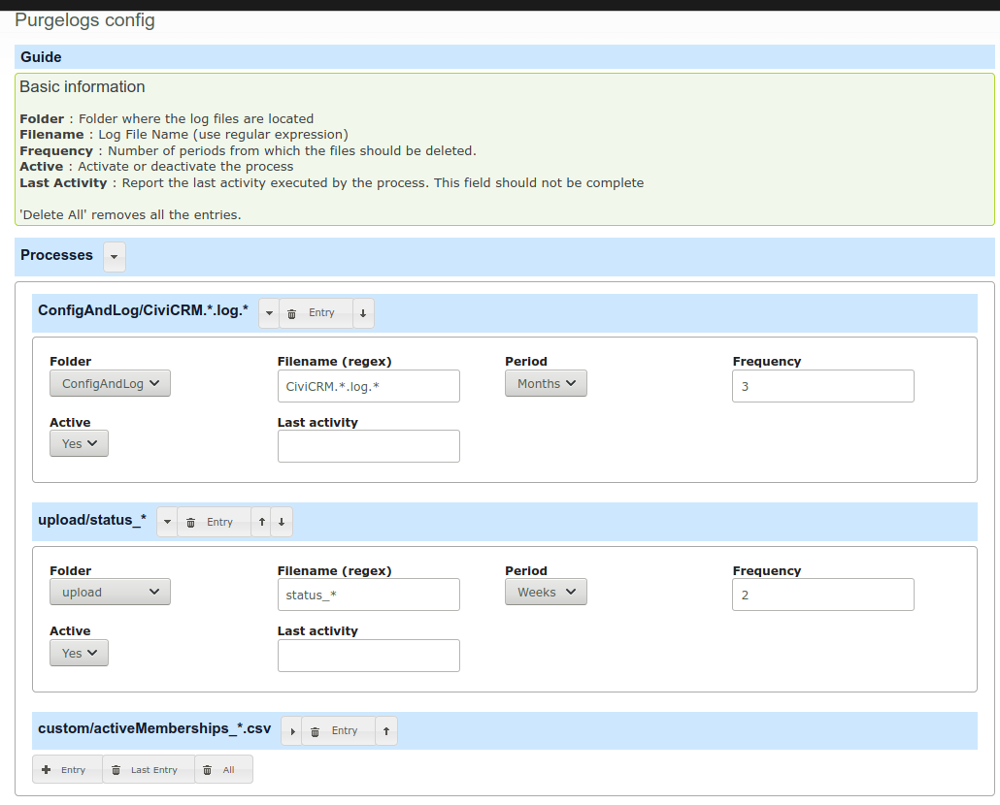

# Purge Logs

**Purge Logs** is a configurable API Job, to remove files older than a defined timeframe. The main intention is to get rid of old rotated `CiviCRM.*.log` files,
but it can be applied to any system or customized file that it's in `<civicrm/files/>` folder.

The extension is licensed under [AGPL-3.0](LICENSE.txt).

## Requirements

* PHP v7.4+
* CiviCRM 5.45+

## Usage

1. Install the extensions
2. Access to *Administer / Purgelogs* menu. There you can set up, the folder, filename (with wildcards), the period and frequency of the old file to be deleted
3. Execute manually the new CiviCRM API `purgelogs.purge` or enable the new **Scheduled Tasks - Purge Logs**, created when this extension is installed

